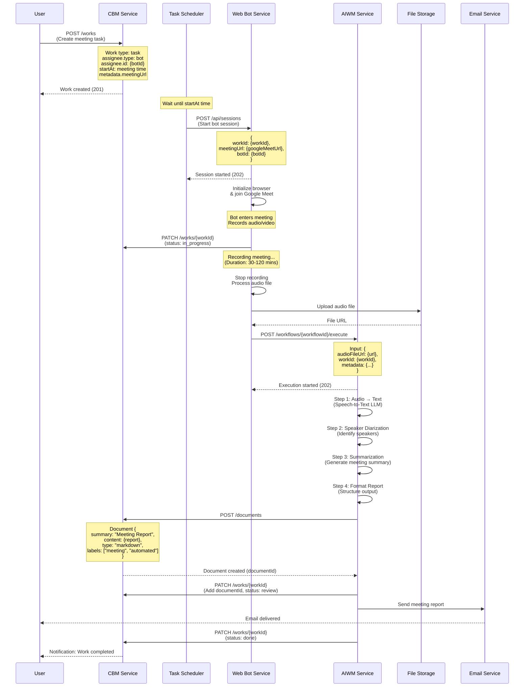

# Web Bot Integration - Meeting Recording & Reporting

## Tổng Quan

Tích hợp Web Bot Service với hệ thống CBM và AIWM để tự động hóa quy trình tham gia cuộc họp, ghi âm và tạo báo cáo cuộc họp tự động.

### Luồng Nghiệp Vụ

1. **Tạo Work (CBM)** - Người dùng tạo task cho Bot tham gia họp Google Meet
2. **Trigger Bot** - Hệ thống gửi yêu cầu đến Web Bot Service khi đến thời gian họp
3. **Join Meeting** - Bot tham gia cuộc họp và ghi âm
4. **Execute Workflow (AIWM)** - Bot đẩy file ghi âm vào workflow xử lý
5. **AI Processing** - Workflow chuyển đổi audio → text → nhận diện người nói → tóm tắt
6. **Save Document (CBM)** - Lưu báo cáo cuộc họp vào Document
7. **Send Email** - Gửi báo cáo đến người dùng

---

## Sơ Đồ Luồng Tổng Thể



---

## Chi Tiết Các Bước

### 1. Tạo Work Task (CBM)

**Endpoint:** `POST /works`

**Request Body:**
```json
{
  "title": "Bot tham gia họp Daily Standup",
  "description": "Bot ghi âm cuộc họp hàng ngày và tạo báo cáo",
  "type": "task",
  "reporter": {
    "type": "user",
    "id": "{userId}"
  },
  "assignee": {
    "type": "bot",
    "id": "{botId}"
  },
  "startAt": "2026-01-22T09:00:00Z",
  "status": "todo",
  "metadata": {
    "meetingUrl": "https://meet.google.com/abc-defg-hij",
    "workflowId": "{workflowId}",
    "attendees": ["user1@example.com", "user2@example.com"]
  }
}
```

**Các trường quan trọng:**
- `assignee.type`: Phải là `"bot"`
- `assignee.id`: ID của bot trong Web Bot Service
- `startAt`: Thời gian bắt đầu họp (trigger time)
- `metadata.meetingUrl`: Google Meet URL
- `metadata.workflowId`: ID của workflow xử lý ghi âm

---

### 2. Trigger Bot (Scheduler → Web Bot)

**Endpoint:** `POST /api/sessions` (Web Bot Service)

**Request Body:**
```json
{
  "workId": "{workId}",
  "botId": "{botId}",
  "meetingUrl": "https://meet.google.com/abc-defg-hij",
  "config": {
    "recordAudio": true,
    "recordVideo": false,
    "maxDuration": 7200000
  }
}
```

**Response:**
```json
{
  "sessionId": "{sessionId}",
  "status": "starting",
  "estimatedStartTime": "2026-01-22T09:00:05Z"
}
```

---

### 3. Bot Joins & Records Meeting

**Web Bot Actions:**
1. Launch browser (Playwright/Puppeteer)
2. Navigate to Google Meet URL
3. Handle authentication (if required)
4. Join meeting
5. Start audio recording
6. Update CBM Work status: `in_progress`

**Callback to CBM:**
```http
PATCH /works/{workId}
{
  "status": "in_progress",
  "metadata": {
    "botSessionId": "{sessionId}",
    "startedAt": "2026-01-22T09:00:15Z"
  }
}
```

---

### 4. Execute Workflow (Web Bot → AIWM)

**Endpoint:** `POST /workflows/{workflowId}/execute`

**Request Body:**
```json
{
  "input": {
    "audioFileUrl": "https://storage.example.com/recordings/{sessionId}.mp3",
    "workId": "{workId}",
    "meetingMetadata": {
      "title": "Daily Standup",
      "startTime": "2026-01-22T09:00:00Z",
      "duration": 1800,
      "attendees": ["user1@example.com", "user2@example.com"]
    }
  },
  "metadata": {
    "source": "web-bot",
    "botSessionId": "{sessionId}"
  }
}
```

**Response:**
```json
{
  "executionId": "{executionId}",
  "status": "running",
  "workflowId": "{workflowId}",
  "createdAt": "2026-01-22T09:35:00Z"
}
```

---

### 5. Workflow Processing (AIWM)

**Workflow Steps:**

#### Step 1: Speech-to-Text
```json
{
  "name": "Audio Transcription",
  "type": "llm",
  "llmConfig": {
    "deploymentId": "{whisper-deployment-id}",
    "systemPrompt": "Transcribe the audio file to text with timestamps",
    "parameters": {
      "temperature": 0.0
    }
  },
  "outputSchema": {
    "type": "object",
    "properties": {
      "transcript": { "type": "string" },
      "timestamps": { "type": "array" }
    }
  }
}
```

#### Step 2: Speaker Diarization
```json
{
  "name": "Identify Speakers",
  "type": "llm",
  "dependencies": ["step1_id"],
  "llmConfig": {
    "deploymentId": "{gpt4-deployment-id}",
    "systemPrompt": "Identify and label different speakers in the transcript",
    "userPromptTemplate": "Transcript: {{step1.output.transcript}}"
  }
}
```

#### Step 3: Meeting Summarization
```json
{
  "name": "Generate Summary",
  "type": "llm",
  "dependencies": ["step2_id"],
  "llmConfig": {
    "deploymentId": "{gpt4-deployment-id}",
    "systemPrompt": "Create a structured meeting summary with key points, action items, and decisions",
    "userPromptTemplate": "Speaker transcript: {{step2.output}}"
  }
}
```

#### Step 4: Format Report
```json
{
  "name": "Format Report",
  "type": "llm",
  "dependencies": ["step3_id"],
  "llmConfig": {
    "deploymentId": "{gpt4-deployment-id}",
    "systemPrompt": "Format the summary into a professional markdown report",
    "userPromptTemplate": "Summary: {{step3.output}}"
  }
}
```

---

### 6. Save Document (AIWM → CBM)

**Endpoint:** `POST /documents`

**Request Body:**
```json
{
  "summary": "Meeting Report: Daily Standup - 2026-01-22",
  "content": "# Meeting Report\n\n## Attendees\n- John Doe\n- Jane Smith\n\n## Key Points\n...",
  "type": "markdown",
  "labels": ["meeting", "automated", "daily-standup"],
  "status": "published",
  "scope": "org",
  "metadata": {
    "workId": "{workId}",
    "executionId": "{executionId}",
    "meetingDate": "2026-01-22T09:00:00Z"
  }
}
```

**Response:**
```json
{
  "id": "{documentId}",
  "summary": "Meeting Report: Daily Standup - 2026-01-22",
  "createdAt": "2026-01-22T09:40:00Z"
}
```

---

### 7. Link Document to Work

**Endpoint:** `PATCH /works/{workId}`

**Request Body:**
```json
{
  "documents": ["{documentId}"],
  "status": "review",
  "metadata": {
    "reportGenerated": true,
    "documentId": "{documentId}"
  }
}
```

---

### 8. Send Email & Complete Work

**Email Service (triggered by AIWM):**
```
To: user1@example.com, user2@example.com
Subject: Meeting Report: Daily Standup - 2026-01-22

Hi Team,

The meeting report for Daily Standup on Jan 22, 2026 is ready.

View full report: https://app.example.com/documents/{documentId}

Summary:
- Total duration: 30 minutes
- 7 action items identified
- 3 decisions made

Best regards,
AI Meeting Assistant
```

**Final Work Update:**
```http
PATCH /works/{workId}
{
  "status": "done",
  "metadata": {
    "completedAt": "2026-01-22T09:45:00Z",
    "emailSent": true
  }
}
```

---

## Entity Schema Reference

### 1. Work (CBM)

**Mục đích:** Quản lý task cho Bot tham gia họp

| Trường | Type | Mô tả | Sử dụng trong Bot Integration |
|--------|------|-------|------------------------------|
| `_id` | ObjectId | ID duy nhất của Work | Tracking task lifecycle |
| `title` | string | Tiêu đề task | Tên cuộc họp |
| `description` | string | Mô tả chi tiết | Ghi chú về cuộc họp |
| `type` | enum | epic/task/subtask | Luôn là `"task"` |
| `reporter` | Object | Người tạo task | User tạo meeting task |
| `assignee` | Object | Người/Bot thực hiện | **Bot assignment** (`type: "bot"`) |
| `startAt` | Date | Thời gian bắt đầu | **Trigger time** cho Bot |
| `status` | enum | Trạng thái task | `todo` → `in_progress` → `review` → `done` |
| `documents` | string[] | Danh sách document IDs | Link đến meeting report |
| `metadata` | Object | Dữ liệu bổ sung | `meetingUrl`, `workflowId`, `botSessionId` |
| `createdBy` | string | User tạo | Audit trail |
| `updatedBy` | string | User cập nhật | Audit trail |

**Ví dụ Work Document:**
```json
{
  "_id": "work_123",
  "title": "Bot Record Daily Standup",
  "type": "task",
  "assignee": {
    "type": "bot",
    "id": "bot_001"
  },
  "startAt": "2026-01-22T09:00:00Z",
  "status": "in_progress",
  "metadata": {
    "meetingUrl": "https://meet.google.com/abc-defg-hij",
    "workflowId": "workflow_456",
    "botSessionId": "session_789"
  }
}
```

---

### 2. Document (CBM)

**Mục đích:** Lưu trữ báo cáo cuộc họp được tạo bởi AI

| Trường | Type | Mô tả | Sử dụng trong Bot Integration |
|--------|------|-------|------------------------------|
| `_id` | ObjectId | ID duy nhất của Document | Reference trong Work.documents |
| `summary` | string | Tiêu đề/tóm tắt | Tên báo cáo cuộc họp |
| `content` | string | Nội dung chính | **Meeting report content** (markdown) |
| `type` | enum | html/text/markdown/json | Luôn là `"markdown"` |
| `labels` | string[] | Nhãn phân loại | `["meeting", "automated", "daily-standup"]` |
| `status` | enum | draft/published/archived | `"published"` khi hoàn thành |
| `scope` | enum | public/org/private | `"org"` để chia sẻ trong tổ chức |
| `metadata` | Object | Dữ liệu bổ sung | `workId`, `executionId`, `meetingDate` |
| `owner` | Object | Chủ sở hữu | User/Organization |
| `createdBy` | string | AI Agent tạo | Audit trail |

**Ví dụ Document:**
```json
{
  "_id": "doc_456",
  "summary": "Meeting Report: Daily Standup - 2026-01-22",
  "content": "# Meeting Report\n\n## Attendees\n- John Doe\n- Jane Smith\n\n## Key Points\n...",
  "type": "markdown",
  "labels": ["meeting", "automated"],
  "status": "published",
  "scope": "org",
  "metadata": {
    "workId": "work_123",
    "executionId": "exec_789"
  }
}
```

---

### 3. Workflow (AIWM)

**Mục đích:** Template cho quy trình xử lý ghi âm cuộc họp

| Trường | Type | Mô tả | Sử dụng trong Bot Integration |
|--------|------|-------|------------------------------|
| `_id` | ObjectId | ID duy nhất của Workflow | Reference trong Work.metadata.workflowId |
| `name` | string | Tên workflow | "Meeting Recording Processing" |
| `description` | string | Mô tả workflow | Chi tiết quy trình xử lý |
| `version` | string | Phiên bản | Version control |
| `status` | enum | draft/active/archived | Phải là `"active"` để execute |
| `executionMode` | enum | internal/langgraph | `"internal"` cho MVP |
| `owner` | Object | Chủ sở hữu | Organization/User |
| `createdBy` | string | User tạo | Audit trail |

**Ví dụ Workflow:**
```json
{
  "_id": "workflow_789",
  "name": "Meeting Audio to Report",
  "description": "Convert meeting audio to structured report with AI",
  "version": "v1.0",
  "status": "active",
  "executionMode": "internal"
}
```

---

### 4. WorkflowStep (AIWM)

**Mục đích:** Định nghĩa từng bước xử lý trong workflow

| Trường | Type | Mô tả | Sử dụng trong Bot Integration |
|--------|------|-------|------------------------------|
| `_id` | ObjectId | ID duy nhất của Step | Reference trong dependencies |
| `workflowId` | ObjectId | ID của Workflow cha | Link đến workflow |
| `name` | string | Tên bước | "Audio Transcription", "Speaker ID" |
| `description` | string | Mô tả bước | Chi tiết xử lý |
| `orderIndex` | number | Thứ tự thực hiện | 0, 1, 2, 3... |
| `type` | enum | llm (MVP only) | Loại step |
| `llmConfig` | Object | Cấu hình LLM | **Deployment, prompts, parameters** |
| `inputSchema` | Object | JSON Schema input | Validation |
| `outputSchema` | Object | JSON Schema output | Validation |
| `dependencies` | string[] | Step IDs phụ thuộc | Execution order |
| `errorHandling` | Object | Retry logic | Fault tolerance |

**Ví dụ WorkflowStep (Audio Transcription):**
```json
{
  "_id": "step_001",
  "workflowId": "workflow_789",
  "name": "Audio Transcription",
  "orderIndex": 0,
  "type": "llm",
  "llmConfig": {
    "deploymentId": "whisper-1",
    "systemPrompt": "Transcribe audio to text with timestamps",
    "parameters": {
      "temperature": 0.0
    }
  },
  "outputSchema": {
    "type": "object",
    "properties": {
      "transcript": { "type": "string" },
      "timestamps": { "type": "array" }
    }
  },
  "dependencies": []
}
```

---

## API Contract giữa các Service

### 1. CBM → Web Bot (Trigger)

**Khi:** Scheduler phát hiện `Work.startAt` đã đến

**Request:**
```http
POST https://webbot.example.com/api/sessions
Content-Type: application/json
Authorization: Bearer {api_key}

{
  "workId": "work_123",
  "botId": "bot_001",
  "meetingUrl": "https://meet.google.com/abc-defg-hij",
  "config": {
    "recordAudio": true,
    "recordVideo": false,
    "maxDuration": 7200000,
    "joinDelay": 5000
  }
}
```

**Response:**
```http
202 Accepted
{
  "sessionId": "session_789",
  "status": "starting",
  "estimatedStartTime": "2026-01-22T09:00:05Z"
}
```

---

### 2. Web Bot → CBM (Update Status)

**Khi:** Bot bắt đầu join meeting

**Request:**
```http
PATCH https://cbm.example.com/works/work_123
Content-Type: application/json
Authorization: Bearer {bot_token}

{
  "status": "in_progress",
  "metadata": {
    "botSessionId": "session_789",
    "joinedAt": "2026-01-22T09:00:15Z"
  }
}
```

**Response:**
```http
200 OK
{
  "id": "work_123",
  "status": "in_progress",
  "updatedAt": "2026-01-22T09:00:15Z"
}
```

---

### 3. Web Bot → AIWM (Execute Workflow)

**Khi:** Bot hoàn thành ghi âm

**Request:**
```http
POST https://aiwm.example.com/workflows/workflow_789/execute
Content-Type: application/json
Authorization: Bearer {bot_token}

{
  "input": {
    "audioFileUrl": "https://storage.example.com/recordings/session_789.mp3",
    "workId": "work_123",
    "meetingMetadata": {
      "title": "Daily Standup",
      "startTime": "2026-01-22T09:00:00Z",
      "endTime": "2026-01-22T09:30:00Z",
      "duration": 1800,
      "attendees": ["user1@example.com", "user2@example.com"]
    }
  },
  "metadata": {
    "source": "web-bot",
    "botSessionId": "session_789"
  }
}
```

**Response:**
```http
202 Accepted
{
  "executionId": "exec_456",
  "status": "running",
  "workflowId": "workflow_789",
  "createdAt": "2026-01-22T09:35:00Z"
}
```

---

### 4. AIWM → CBM (Save Document)

**Khi:** Workflow hoàn thành tạo báo cáo

**Request:**
```http
POST https://cbm.example.com/documents
Content-Type: application/json
Authorization: Bearer {aiwm_token}

{
  "summary": "Meeting Report: Daily Standup - 2026-01-22",
  "content": "# Meeting Report\n\n## Attendees\n...",
  "type": "markdown",
  "labels": ["meeting", "automated", "daily-standup"],
  "status": "published",
  "scope": "org",
  "metadata": {
    "workId": "work_123",
    "executionId": "exec_456",
    "meetingDate": "2026-01-22T09:00:00Z"
  }
}
```

**Response:**
```http
201 Created
{
  "id": "doc_789",
  "summary": "Meeting Report: Daily Standup - 2026-01-22",
  "createdAt": "2026-01-22T09:40:00Z"
}
```

---

### 5. AIWM → CBM (Link Document to Work)

**Khi:** Document đã được tạo

**Request:**
```http
PATCH https://cbm.example.com/works/work_123
Content-Type: application/json
Authorization: Bearer {aiwm_token}

{
  "documents": ["doc_789"],
  "status": "review",
  "metadata": {
    "reportGenerated": true,
    "documentId": "doc_789",
    "completedAt": "2026-01-22T09:40:00Z"
  }
}
```

**Response:**
```http
200 OK
{
  "id": "work_123",
  "documents": ["doc_789"],
  "status": "review",
  "updatedAt": "2026-01-22T09:40:00Z"
}
```

---

## Error Handling & Recovery

### 1. Bot Join Failed

**Scenario:** Bot không thể join meeting (invalid URL, permission denied)

**Action:**
```http
PATCH /works/{workId}
{
  "status": "blocked",
  "reason": "Bot unable to join meeting: Invalid Google Meet URL"
}
```

**Recovery:** User kiểm tra lại URL hoặc permission settings

---

### 2. Recording Failed

**Scenario:** Recording bị lỗi giữa chừng

**Action:**
```http
PATCH /works/{workId}
{
  "status": "blocked",
  "reason": "Recording interrupted: Browser crashed at 15:30"
}
```

**Recovery:** Web Bot tự động retry hoặc notify user

---

### 3. Workflow Execution Failed

**Scenario:** Một step trong workflow fail

**Action:**
- Workflow retry theo `errorHandling.maxRetries`
- Nếu vẫn fail → Update Work status

```http
PATCH /works/{workId}
{
  "status": "blocked",
  "reason": "Workflow step 'Audio Transcription' failed after 3 retries",
  "metadata": {
    "executionId": "exec_456",
    "failedStep": "step_001"
  }
}
```

**Recovery:** User review và re-execute workflow

---

### 4. Document Save Failed

**Scenario:** CBM không thể lưu document

**Action:**
- AIWM retry save operation
- Nếu fail → Log error và notify

**Recovery:** Manual intervention hoặc retry

---

## Configuration Requirements

### Web Bot Service Configuration

```json
{
  "cbm": {
    "baseUrl": "https://cbm.example.com",
    "apiKey": "{cbm_api_key}"
  },
  "aiwm": {
    "baseUrl": "https://aiwm.example.com",
    "apiKey": "{aiwm_api_key}"
  },
  "storage": {
    "provider": "s3",
    "bucket": "meeting-recordings",
    "region": "us-east-1"
  },
  "bot": {
    "maxConcurrentSessions": 10,
    "maxRecordingDuration": 7200000,
    "audioFormat": "mp3",
    "audioBitrate": "128k"
  }
}
```

---

### CBM Configuration (Task Scheduler)

```json
{
  "scheduler": {
    "enabled": true,
    "pollInterval": 60000,
    "lookAhead": 300000
  },
  "webBot": {
    "baseUrl": "https://webbot.example.com",
    "apiKey": "{webbot_api_key}",
    "timeout": 10000
  }
}
```

---

### AIWM Workflow Configuration

**Workflow ID:** `workflow_meeting_processing`

**Steps:**
1. Audio Transcription (Whisper)
2. Speaker Diarization (GPT-4)
3. Meeting Summarization (GPT-4)
4. Report Formatting (GPT-4)

**Required Deployments:**
- Whisper API deployment
- GPT-4 deployment (or equivalent LLM)

---

## Security Considerations

### 1. Authentication

- **Web Bot ↔ CBM:** JWT token hoặc API key
- **Web Bot ↔ AIWM:** JWT token hoặc API key
- **AIWM ↔ CBM:** Service-to-service authentication

### 2. Authorization

- Bot chỉ có quyền:
  - Update Work status
  - Upload recordings
  - Execute workflows

- AIWM chỉ có quyền:
  - Create documents
  - Update works (limited fields)

### 3. Data Privacy

- Meeting recordings lưu trên encrypted storage
- Transcripts và reports tuân thủ GDPR/compliance
- PII detection trong AIWM Guardrail module

### 4. Rate Limiting

- Web Bot API: 100 requests/minute
- AIWM Execution: 50 workflows/hour/user

---

## Testing Scenarios

### Test Case 1: Happy Path

1. Create Work với `assignee.type = "bot"`
2. Bot join meeting thành công
3. Recording hoàn thành
4. Workflow execute thành công
5. Document được tạo và link vào Work
6. Email được gửi
7. Work status = `done`

**Expected:** Toàn bộ flow hoàn thành trong 5-10 phút sau khi meeting kết thúc

---

### Test Case 2: Invalid Meeting URL

1. Create Work với invalid Google Meet URL
2. Bot attempt join → fail
3. Work status → `blocked`
4. User nhận notification

**Expected:** Fail fast trong 30 giây, clear error message

---

### Test Case 3: Long Meeting (>2 hours)

1. Meeting kéo dài >2 giờ
2. Bot stop recording tại `maxDuration`
3. Process partial recording
4. Document với note "Partial recording (2 hours)"

**Expected:** Graceful handling, không crash

---

### Test Case 4: Workflow Step Failure

1. Audio transcription step fail (API error)
2. Workflow retry 3 lần
3. Nếu vẫn fail → Work status `blocked`
4. Notification đến user với error details

**Expected:** Auto-retry, clear error reporting

---

## Metrics & Monitoring

### Key Metrics

1. **Bot Join Success Rate:** % meetings bot join thành công
2. **Recording Completion Rate:** % recordings hoàn thành
3. **Workflow Success Rate:** % workflows execute thành công
4. **End-to-End Latency:** Thời gian từ meeting end → document ready
5. **Document Quality Score:** User feedback on report quality

### Monitoring Endpoints

- Web Bot: `GET /health` - Bot service health
- AIWM: `GET /executions/{executionId}` - Workflow execution status
- CBM: `GET /works/{workId}` - Task status

---

## Roadmap & Future Enhancements

### Phase 1 (MVP) - Current Scope
- ✅ Google Meet integration
- ✅ Audio recording only
- ✅ Basic workflow (transcript → summary)
- ✅ Markdown reports
- ✅ Email delivery

### Phase 2
- 🔲 Video recording support
- 🔲 Screen sharing capture
- 🔲 Real-time transcription
- 🔲 Multi-language support

### Phase 3
- 🔲 Zoom, MS Teams integration
- 🔲 Advanced AI features (action item extraction, sentiment analysis)
- 🔲 Calendar integration (auto-schedule bot)
- 🔲 Interactive reports (Q&A on meeting content)

---

## FAQ

### Q: Bot có thể join meeting private không?

A: Có, nhưng cần pre-configure bot account với permission để join. Best practice là thêm bot email vào calendar invite.

---

### Q: Xử lý như thế nào nếu meeting bị cancel?

A: User nên update Work status → `cancelled` trước `startAt` time. Scheduler sẽ skip trigger.

---

### Q: Có giới hạn số bot concurrent không?

A: Có, mặc định là 10 concurrent sessions. Configure trong Web Bot Service.

---

### Q: Audio file được lưu bao lâu?

A: 30 ngày theo mặc định. Sau đó tự động delete. Document (text) lưu vĩnh viễn.

---

### Q: Workflow có thể customize không?

A: Có, admin có thể tạo custom workflows với các steps khác nhau trong AIWM.

---

## Contact & Support

**Technical Owner:** Backend Dev Team

**Services:**
- CBM: core-business-management@example.com
- Web Bot: web-bot-team@example.com
- AIWM: ai-workload-team@example.com

**Documentation Updates:** Submit PR to `/docs/web-bot-integration/`

---

_Last Updated: 2026-01-21_
_Version: 1.0_
